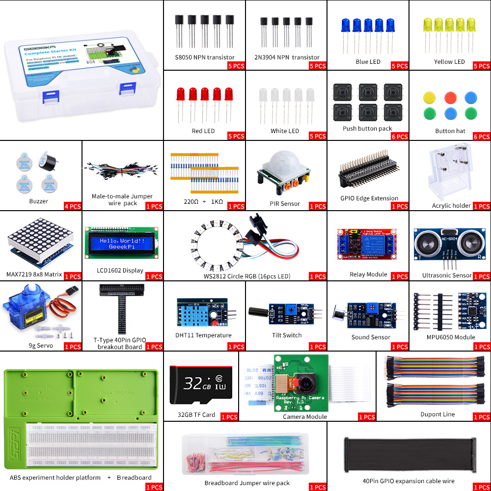

# picsk
* Picsk stands for Raspberry Pi Complete Starter Kit. 
## Description
This is Complete Starter Kit for Raspberry Pi 4B/3B/3B+/Pi400, \The kit includes a variety of components and modules for building electronic projects. It contains an MPU6050 module, a 1-channel relay, a tilt sensor, a sound sensor, a T-type GPIO expansion board, a GPIO edge expansion board, an ultrasonic sensor, a DHT11 temperature and humidity sensor, an LCD1602 display module, a PIR sensor, a servo motor, a long breadboard, 40-pin jump wires, a WS2812 RGB light ring, an experiment platform plate, a 500W camera, R/G/B LED lights, a MAX7219 8x8 matrix, and S8050 and 2N9304 NPN transistors. Additionally, it includes 220 ohms and 1k ohm resistors.
## Features
* MPU6050: A motion-tracking device that combines a 3-axis gyroscope and a 3-axis accelerometer.
* 1-channel relay: Allows you to control high-power devices using a low-power signal.
* Tilt sensor: Detects changes in orientation and can be used to trigger actions based on tilt.
* Sound sensor: Detects sound levels and can be used for sound-activated projects.
* T-type GPIO expansion board: Provides additional GPIO pins for connecting more components.
* GPIO edge expansion board: Expands the GPIO pins of a microcontroller for connecting more devices.
* Ultrasonic sensor: Measures distance using sound waves and can be used for proximity sensing.
* DHT11 temperature and humidity sensor: Measures ambient temperature and humidity levels.
* LCD1602 display module: A 16x2 character LCD display for showing text and simple graphics.
* PIR sensor: Detects motion and can be used for security or automation purposes.
* Servo: A motor that can be controlled precisely for various robotic and mechanical applications.
* Long breadboard: Provides a platform for prototyping circuits and connecting multiple components.
* 40-pin jump wires: Allows for easy connection between components on a breadboard or circuit.
* WS2812 RGB light ring: A ring of individually addressable RGB LEDs for colorful lighting effects.
* Experiment platform plate: A platform for securely mounting and organizing components during experiments.
* 500W camera: A high-resolution camera capable of capturing detailed images and videos.
* R/G/B LED lights: Three separate LED lights in red, green, and blue colors for various lighting projects.
* MAX7219 8x8 matrix: An LED matrix display that can show text and simple patterns.
* S8050 and 2N9304 NPN transistors: Electronic switches used for amplification or switching applications.
* 220 ohm / 1k ohm resistor: Resistors for controlling current flow and voltage levels in circuits.

## Package Includes

